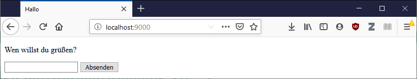

# Superglobals

PHP kann als `web-native` Programmiersprache bezeichnet werden. Die Programmiersprache wurde grundsätzlich mit dem Ziel der Web-Entwicklung geschaffen und hat dadurch einige built-in Konstrukte die hauptsächlich in der Web-Entwicklung nützlich sind.

PHP definiert einige globale Variablen (bezeichnet als Superglobals), welche wichtige Informationen zum HTTP-Request und zur Server Umgebung enthalten. Superglobals sind als assoziative Arrays angelegt. Superglobales sind nur sinnvoll zu verweden, wenn PHP am Web-Server ausgeführt wird. Für Kommandozeilen Programme sind Superglobales nutzlos. Folgende Superglobals sind definiert:

 - `$_SERVER`: wichtige Informationen zum aktuellen HTTP-Request und Serverkontext
 - `$_GET`: Schlüssel/Wert Paare, welche URL Parameter enthalten
 - `$_POST`: Schlüssel/Wert Paare, welche Daten aus dem HTTP-Body enthalten
 - `$_FILES`: Falls Dateien an den Server gesendet werden, sind die temporären Pfade und Statusinformationen darüber dort enthalten
 - `$_COOKIE`: Schlüssel/Wert Paare über Cookies, welche im HTTP-Request übertragen wurden
 - `$_SESSION`: Schlüssel/Wert Paare zur aktuellen Session, welche am Server gespeichert ist (Referenziert über Session-Cookie)
 - `$_REQUEST`: Zusammenfassung von `$_GET`, `$_POST`, `$_COOKIE`
 - `$_ENV`: Umgebungsvariablen am Server

## Beispiel: $_GET 

Die Superglobal `$_GET` enthält alle Schlüssel/Wert Paare, welche als URL-Parameter (Querystring) an das PHP-Skript übergeben wurden.

Die Variable `$name` im Skript wird über den URL-Parameter `name` gesetzt. Wird kein URL-Parameter `name` angegeben, so erhält die Variable `$name` den Wert `"Welt"` (Null-Coalesing Operator).

```php
<?php
    $name = $_GET['name'] ?? "Welt";
?>
<!DOCTYPE html>
<html>
<head>
    <title>Hallo <?php echo $name; ?></title>
</head>
<body>
    <p>
        Hallo <?php echo $name; ?>!
    </p>
</body>
</html>
```

Wird das Skript über die URL `http://localhost:9000` aufgerufen, sieht die Ausgabe ähnlich zum Screenshot unten aus:


Falls das Skript über die URL `http://localhost:9000?name=Franzi` aufgerufen wird, wird die Variable `$name` mit dem Wert `"Franzi"` belegt und die Ausgabe resultiert in `Hallo Franzi`. Dies entspricht dem unten angeführten Screenshot:


## Beispiel: $_POST

Die Superglobal `$_POST` enthält alle Schlüssel/Wert Paare, welche im HTTP-Body an das PHP-Skript übergeben wurden.

Die Variable `$name` im Skript wird über ein Formularfeld gesetzt dieses hat das Attribute `name` mit dem Attributwert `firstname` gesetzt. Dadurch enthält der HTTP-Body beim Absenden des Formulars den Schlüssel `firstname` mit entsprechendem Wert (aus dem Formularfeld).

```php
<?php
$name = $_POST['firstname'] ?? "";
?>
<!DOCTYPE html>
<html>
<head>
    <title>Hallo <?php echo $name; ?></title>
</head>
<body>
<p>
    <?php echo $name ? "Hallo $name!" : "Wen willst du grüßen?"; ?>
</p>
<form method="post">
    <input name="firstname" value="<?php echo $name; ?>">
    <button type="submit">Absenden</button>
</form>
</body>
</html>
```

Im Screenshot wird das Skript über den lokalen Web-Server aufgerufen mit der URL `http://localhost:8080`.



Bei Absenden des Formulars mit dem Wert `Studenten` wird das Schlüssel/Wert Paar `firstname=Studenten` als POST (HTTP-Request mit Methode POST) an den Web-Server gesendet. Die Verarbeitung am Web-Server führt dazu, dass die Variable `$name` mit dem Wert `Studenten` belegt wird und an unterschiedlichen Stellen zur entsprechenden Ausgabe führt:


