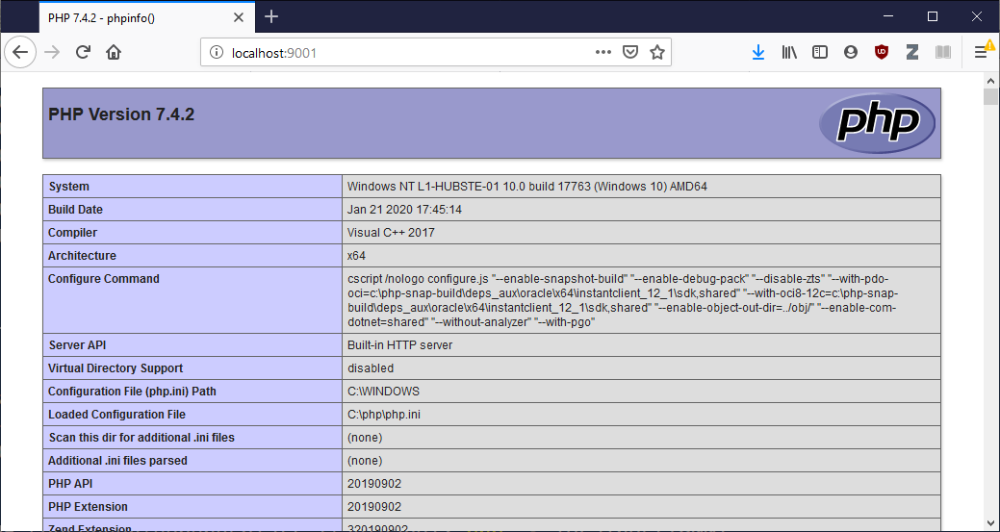

# PHP Konfiguration

Die PHP-Laufzeitumgebung wird über eine ini-Datei konfiguriert. In diesem Tutorial wird erklärt wie Sie PHP über eine ini-Datei konfigurieren und wie eine ini-Datei grundsätzlich aufgebaut ist.

## php.ini

PHP nutzt die Konfigurationsdatei mit dem Namen `php.ini` im Verzeichnis `C:\php` als zentrale Konfigurationsdatei. Nach der Installation über das [Tutorial](../01) liegen im Ordner `C:\php` 2 ini-Dateien als Vorlagen. `php.ini-development` als Konfiguration für einen Entwicklungsrechner und `php.ini-production` für eine produktive Umgebung.

Für Ihren Entwicklungsrechner soll die Datei `php.ini-development` in `php.ini` umbenannt werden. Dadurch wird diese Datei zur aktuellen Konfiguration der PHP-Laufzeitumgebung.

## Syntax der ini-Datei

Die `php.ini` Datei ist nach dem [INI Dateiformat](https://en.wikipedia.org/wiki/INI_file) organisiert. Zusammengefasst sind dabei folgende Aspekte relevant:

 - Die ini-Datei ist in Abschnitte gegliedert. Ein Abschnitt wird mit eckigen Klammern ausgewiesen. Zum Beispiel wird der Abschnitt um Konfigurationen zu PostgreSQL durchzuführen als `[PostgreSQL]` angegeben.
 - Eine ini-Datei kann Kommentare enthalten, diese werden über das `;`-Symbol angegeben.
 - Eine Konfiguration wird als Schlüssel/Wert Paar angegeben (zB `post_max_size = 8M`).

Im folgenden findet sich ein beispielhafter Auszug einer ini-Datei:

```ini
[PHP]
; Maximum size of POST data that PHP will accept.
; Its value may be 0 to disable the limit. It is ignored if POST data reading
; is disabled through enable_post_data_reading.
; http://php.net/post-max-size
post_max_size = 8M

[CLI Server]
; Whether the CLI web server uses ANSI color coding in its terminal output.
cli_server.color = On
```

## Wichtige Konfigurationen

### Erweiterungen aktivieren

Es gibt eine Vielzahl an Erweiterungen, welche mit PHP mitgeliefert werden. Diese Erweiterungen sind anfänglich deaktiviert. Um eine spezielle Erweiterung zu aktivieren, muss der Kommentar zum entsprechenden Schlüssel/Wert Paar entfernt werden.

Die Erweiterung zur Nutzung von SQLite ist deaktiviert. Suchen Sie dazu das Schlüssel/Wert Paar `extension=pdo_sqlite`:

```ini
;extension=pdo_sqlite
```

Falls dieses mit einem Kommentar versehen ist wie im obigen Beispiel, entfernen Sie den Kommentar und die Erweiterung ist aktiviert:

```init
extension=pdo_sqlite
```

### Browscap aktivieren

Browscap bietet die Funktion HTTP-Header von User-Agents auszuwerten. Jeder User-Agent ist über einen speziellen "User-Agent String" identifiziert. Ein "User-Agent String" ist nicht standardisiert, mit Bibliotheken wie Browscap können wichtige Informationen aus diesen Strings extrahiert werden.

Im folgenden findet sich ein Beispiel eines "User-Agent Strings". Dieses Beispiel stammt aus einem Firefox Browser auf einem Windows Desktop Rechner:

```
Mozilla/5.0 (Windows NT 6.1; Win64; x64; rv:47.0) Gecko/20100101 Firefox/47.0
```
Um in PHP Browscap zu aktivieren, muss (1) die aktuelle Browscap ini-Datei heruntergeladen werden und (2) muss diese über die `php.ini` eingebunden werden.

1. Laden Sie dazu die entsprechende ini-Datei der [Browscap Website](http://browscap.org/) herunter (`php_browscap.ini`).
2. Legen Sie die Datei in das Verzeichnis `C:\php`
3. Referenzieren Sie die ini-Datei über eine absolute Pfadangabe in der `php.ini`. Ändern Sie dazu die `php.ini` an der entsprechenden Stelle folgend ab:

```
[browscap]
; http://php.net/browscap
browscap = C:/php/php_browscap.ini
```

## Konfigurationsübersicht

Um die Konfiguration einer PHP-Laufzeitumgebung einzusehen und zu prüfen, bietet PHP die Funktion `phpinfo`. Erstellen Sie eine Datei `index.php` innerhalb eines beliebigen Ordners. Der Inhalt der `index.php` soll folgenden Quellcode enthalten:

```php
<?php
phpinfo();
```

Starten Sie einen lokalen Web-Server und öffnen Sie die `index.php` Datei über den Web-Browser. Es sollte eine Website erscheinen die dem Screenshot entspricht. Sie finden darauf alle Konfigurationen strukturiert aufgelistet, welche in der `php.ini` vorgenommen sind. Im unten angeführten Screenshot finden Sie eine beispielhafte Ausgabe der `phpinfo` Funktion (Versionsangaben werden in Ihrem Beispiel abweichen!).



## Häufige Probleme

- Falls der Web-Server gestartet ist, während eine Konfiguration geändert wird, muss der Web-Server gestoppt und neu gestartet werden. Für CLI-Skripte ist kein Neustart erforderlich.
