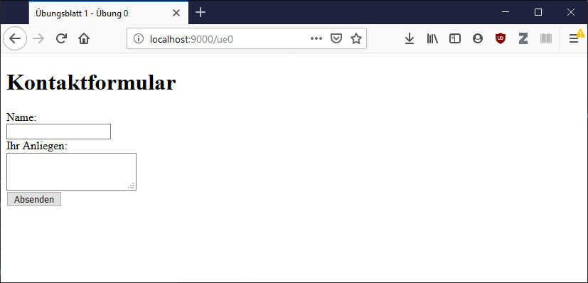

# Übungsblatt 1 - Übung 0

## Start

Übung 0 ist eine "einfache" Vorbereitungsübung zu den weiteren Übungen im Übungsblatt. Inhaltlich geht es um die Formularverarbeitung. Ausgangspunkt der Übung ist eine php-Datei mit folgendem Inhalt:

```php
<!DOCTYPE html>
<html>
<head>
    <title>Übungsblatt 1 - Übung 0</title>

    <style>
        .success {background: green;padding: 10px 5px; color: #fff;}
        label.error {color: red;}
        input.error, textarea.error {border: 1px solid red;}
        label, input, textarea {display: block;}
    </style>
</head>
<body>

<h1>Kontaktformular</h1>

<div class="success">Vielen Dank für die Kontaktaufnahme!</div>

<form method="post" action="/ue0/index.php">
    <label for="name">Name:</label>
    <input name="name" value="">
    <label for="message">Ihr Anliegen:</label>
    <textarea name="message" ></textarea>
    <input type="submit" value="Absenden">
</form>

</body>
</html>
```

Wird der PHP-Webserver im Root-Ordner des Projektes gestartet `php -S localhost:9000` und die URL `http://localhost:9000/ue0` im Web-Browser aufgerufen sollte die Ausgabe ähnlich aussehen:


Dabei ist auffällig, dass die Erfolgsnachricht bereits eingeblendet ist, obwohl das Formular nicht abgesendet wurde.

## Erfolgsmeldung konditional einblenden

Die Erfolgsnachricht soll ausgeblendet werden und nur sichbar sein, wenn eine Variable `$success` als wahr interpretiert wird.

Dazu wird im ersten Schritt die Variable `$success` erstellt und mit dem Wert `false` initialisiert. Dieser Wert soll später abgeändert werden, wenn tatsächlich eine erfolgreiches Formular abgesendet wurde.

Weiters wird eine `if-Block` um die Erfolgsmeldung gelegt. Wichtig dabei ist, dass der PHP-Block in zwei Teile aufgeteilt wird. Im ersten Teil befindet sich die Bedingung `if (...) {` mit öffnendem `{`. Innerhalb des `if-Block`, also innerhalb der geschweiften Klammern (`{ ... }`) befindet sich das HTML-Markup. Nachdem Markup wird der `if-Block` wieder geschlossen `}`.

```php
<!DOCTYPE html>
<html>
<head>
    <title>Übungsblatt 1 - Übung 0</title>

    <style>
        .success {background: green;padding: 10px 5px; color: #fff;}
        label.error {color: red;}
        input.error, textarea.error {border: 1px solid red;}
        label, input, textarea {display: block;}
    </style>
</head>
<body>

<h1>Kontaktformular</h1>

<?php
$success = false;
?>

<?php if ($success) { ?>
<div class="success">Vielen Dank für die Kontaktaufnahme!</div>
<?php } ?>

<form method="post" action="/ue0/index.php">
    <label for="name">Name:</label>
    <input name="name" value="">
    <label for="message">Ihr Anliegen:</label>
    <textarea name="message" ></textarea>
    <input type="submit" value="Absenden">
</form>

</body>
</html>
```

Mit diesem Schritt wird die Erfolgsmeldung erstmal ausgeblendet und wird nur eingeblendet, wenn die Variable `$success` wahr wird.



## Formular Verarbeitung

Wird das Formular abgesendet, sowohl mit Inhalten oder auch leer ändert sich nichts in der Antwort. Zumindest wenn beide Formularfelder (Name und Anliegen) angegeben wurden, soll die Erfolgsmeldung ausgegeben werden.

Im ersten Schritt prüfen wir, ob es sich um einen POST-Request handelt. Die verwendete Request-Methode findet man in der Superglobal `S_SERVER` über den Schlüssel `REQUEST_METHOD`. In weiterer Folge soll geprüft werden, ob die Formularfelder entsprechende Werte enthalten. Dazu kann die `empty` Funktion genutzt werden. Mit `!empty($_POST['name'])` bzw. `!empty($_POST['message'])` wird überprüft, ob die entsprechenden Formularfelder mit Inhalt belegt sind.

```php
<!DOCTYPE html>
<html>
<head>
    <title>Übungsblatt 1 - Übung 0</title>

    <style>
        .success {background: green;padding: 10px 5px; color: #fff;}
        label.error {color: red;}
        input.error, textarea.error {border: 1px solid red;}
        label, input, textarea {display: block;}
    </style>
</head>
<body>

<h1>Kontaktformular</h1>

<?php
$success = false;

if ($_SERVER['REQUEST_METHOD'] == 'POST') {
    if (!empty($_POST['name']) && !empty($_POST['message'])) {
		$success = true;
	}
}

?>

<?php if ($success) { ?>
<div class="success">Vielen Dank für die Kontaktaufnahme!</div>
<?php } ?>

<form method="post" action="/ue0/index.php">
    <label for="name">Name:</label>
    <input name="name" value="">
    <label for="message">Ihr Anliegen:</label>
    <textarea name="message" ></textarea>
    <input type="submit" value="Absenden">
</form>

</body>
</html>
```

Die Änderungen führen dazu, dass ein ausgefülltes Formular die Erfolgsmeldung einblenden lässt.

## Formular Validierung

Ein Absenden eines leeren oder unvollständigen Formulars zeigt noch keine Formularfehler an. Es wäre das Ziel die `.error` Klassen auf den HTML-Elementen `label`, `input` bzw. `textarea` bei entsprechenden nicht ausgefüllten Formularfeldern zu setzten.

Es sollen deshalb 2 Variablen `$error_name` und `$error_message` erstellt werden. Diese Variablen bestimmen, ob die Klasse `.error` an den entsprechenden HTML-Elementen gesetzt wird. Dazu fügen einen PHP-Block innerhalb des HTML-Attributes `class` ein: `class="<?php echo $error_name ? 'error' : ''; ?>"`. Im PHP-Block wird ein ternäter Operator genutzt um den Wert `'error'` über `echo` in Dokument zu schreiben, falls die Variable `$error_name` wahr ist.

Falls nicht beide POST-Parmeter `$_POST['name']` und `$_POST['message']` gesetzt sind, werden die beiden Variablen `$error_name` bzw. `$error_message` entsprechend als `true` oder `false` gesetzt.

```php
<!DOCTYPE html>
<html>
<head>
    <title>Übungsblatt 1 - Übung 0</title>

    <style>
        .success {background: green;padding: 10px 5px; color: #fff;}
        label.error {color: red;}
        input.error, textarea.error {border: 1px solid red;}
        label, input, textarea {display: block;}
    </style>
</head>
<body>

<h1>Kontaktformular</h1>

<?php
$success = false;
$error_name = false;
$error_message = false;

if ($_SERVER['REQUEST_METHOD'] == 'POST') {
    if (!empty($_POST['name']) && !empty($_POST['message'])) {
		$success = true;
	} else {
		$error_name = empty($_POST['name']);
		$error_message = empty($_POST['message']);
	}	
}

?>

<?php if ($success) { ?>
<div class="success">Vielen Dank für die Kontaktaufnahme!</div>
<?php } ?>

<form method="post" action="/ue0/index.php">
    <label for="name" class="<?php echo $error_name ? 'error' : ''; ?>">Name:</label>
    <input name="name" value="" class="<?php echo $error_name ? 'error' : ''; ?>">
    <label for="message" class="<?php echo $error_message ? 'error' : ''; ?>">Ihr Anliegen:</label>
    <textarea name="message" class="<?php echo $error_message ? 'error' : ''; ?>"></textarea>
    <input type="submit" value="Absenden">
</form>

</body>
</html>
```

## Formular Usability

Der letzte Feinschliff für das Formular liegt darin, dass beim Absenden eines fehlerhaften Formulars mit nur einem Fehler, der zweite (jedoch korrekte) Formularwert nicht übernommen bleibt. Siehe dazu den unten angefügten Screenshot. Das Anliegen wurde korrekt eingegeben, wird jedoch nicht übernommen und müsste erneut eingegeben werden:


```php
<!DOCTYPE html>
<html>
<head>
    <title>Übungsblatt 1 - Übung 0</title>

    <style>
        .success {background: green;padding: 10px 5px; color: #fff;}
        label.error {color: red;}
        input.error, textarea.error {border: 1px solid red;}
        label, input, textarea {display: block;}
    </style>
</head>
<body>

<h1>Kontaktformular</h1>

<?php
$success = false;
$error_name = false;
$error_message = false;
$name = "";
$message = "";

if ($_SERVER['REQUEST_METHOD'] == 'POST') {
    if (!empty($_POST['name']) && !empty($_POST['message'])) {
		$success = true;
	} else {
		$error_name = empty($_POST['name']);
		$error_message = empty($_POST['message']);
		$name = $_POST['name'];
        $message = $_POST['message'];
	}	
}

?>

<?php if ($success) { ?>
<div class="success">Vielen Dank für die Kontaktaufnahme!</div>
<?php } ?>

<form method="post" action="/ue0/index.php">
    <label for="name" class="<?php echo $error_name ? 'error' : ''; ?>">Name:</label>
    <input name="name" value="<?php echo $name; ?>" class="<?php echo $error_name ? 'error' : ''; ?>">
    <label for="message" class="<?php echo $error_message ? 'error' : ''; ?>">Ihr Anliegen:</label>
    <textarea name="message" class="<?php echo $error_message ? 'error' : ''; ?>"><?php echo $message; ?></textarea>
    <input type="submit" value="Absenden">
</form>

</body>
</html>
```

Die oben angeführten Änderungen führen nun dazu, dass auch die Formular Usability entsprechend unterstützt wird. Dies wird im unten angeführten Screenshot deutlich:


